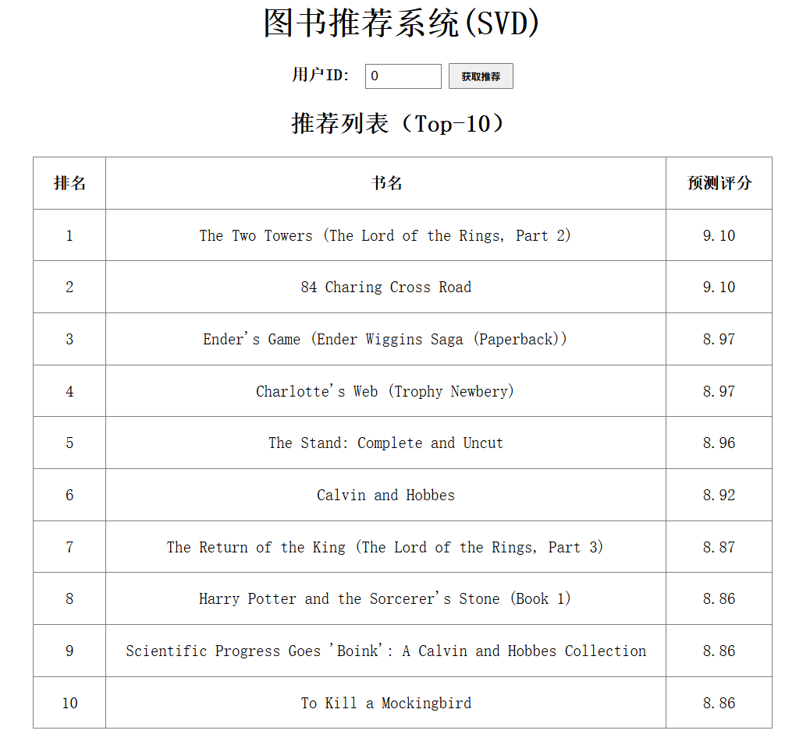

## 图书推荐系统 Web 应用

将Book-Recommend-System项目中训练的图书推荐模型（ **SVD**）扩展为一个**前后端分离的 Web 项目**，提供 **Vue 前端** + **Flask 后端**完整 Web 服务，让用户通过浏览器交互，获得个性化图书推荐。

#### web页面展示

用户输入用户 ID，系统返回 Top-10 个性化图书推荐（含预测评分）。



---

#### 目录结构

```
book-recommend-web/
├── backend/                 # Flask 后端
│   ├── app.py               # 主程序
│   ├── svd_model.pkl        # 训练好的 SVD 模型
│   └── requirements.txt     # Python 依赖
├── frontend/                # Vue 前端
│   ├── public/
│   ├── src/
│   │   ├── App.vue          # 主组件
│   │   └── main.js
│   ├── package.json
│   └── ...
└── README.md
```

---

#### 环境要求

- **Python 3.8+**（推荐 3.9）
- **Node.js 16+** 及 npm
- **pip** 包管理器

---

#### 安装与运行

##### 1. 克隆项目（或直接复制文件夹）

```bash
cd book-recommend-web
```

##### 2. 后端部署

```bash
cd backend
# 创建虚拟环境（可选）
python -m venv venv
# 激活虚拟环境
# Windows: venv\Scripts\activate
# Linux/Mac: source venv/bin/activate

# 安装依赖
pip install -r requirements.txt
```

**模型文件说明**  
确保 `svd_model.pkl` 存在于 `backend/` 目录下，该文件应包含以下键：
- `P`：用户隐向量矩阵
- `Q`：物品隐向量矩阵
- `b_u`：用户偏置
- `b_i`：物品偏置
- `global_mean`：全局平均分
- `idx_to_title`：内部索引 → 书名字典

如果缺少该文件，请使用提供的训练脚本 `svd_recommend.py` （在Book-Recommend-System仓库）重新生成并保存。

**启动后端**

```bash
python app.py
```

后端将运行在 `http://localhost:5000`。  
调试模式下代码修改会自动重启。

---

##### 3. 前端部署

打开新的终端窗口，进入前端目录：

```bash
cd frontend
# 安装依赖（首次运行）
npm install

# 安装 axios（如果还未安装）
npm install axios
```

**修改 API 地址（可选）**  
如果后端运行在非默认地址，请编辑 `src/App.vue` 中 `axios.post` 的 URL。

**启动前端开发服务器**

```bash
npm run serve
```

前端将运行在 `http://localhost:8080`。

---

##### 4. 访问应用

打开浏览器访问 `http://localhost:8080`，输入合法的用户 ID（范围取决于模型，例如 `0` ~ `1799`），点击“获取推荐”，即可看到 Top-10 推荐图书及评分。

---

#### API 接口文档

##### 端点：`POST /recommend`

**请求格式**

```json
{
  "user_id": 123
}
```

**响应格式（成功）**

```json
{
  "recommendations": [
    { "title": "The Two Towers", "score": 9.10 },
    { "title": "1984", "score": 8.95 }
  ]
}
```

**响应格式（错误）**

```json
{
  "error": "用户ID范围 0-1799"
}
```

**状态码**
- `200`：成功
- `400`：请求参数错误（缺少 user_id 或类型错误）
- `500`：服务器内部错误（模型计算异常等）

---

#### 常见问题

##### Q1: 前端点击按钮后无反应，控制台报跨域错误？
**A**: 后端已启用 CORS（`flask_cors`），请检查后端是否正常运行，且前端请求地址为 `http://localhost:5000/recommend`。

##### Q2: 返回“用户ID范围”错误？
**A**: 当前模型只包含部分用户。请根据后端打印的 `P.shape[0]` 修改前端 `App.vue` 中的 `maxUserId` 值。

##### Q3: 推荐列表中出现“未知图书XXX”？
**A**: 模型文件中缺少 `idx_to_title` 映射，或映射不完整。请重新保存模型时确保包含该书名字典。

##### Q4: 运行 `npm run serve` 提示缺少 `vue` 命令？
**A**: 请先全局安装 Vue CLI：
```bash
npm install -g @vue/cli
```

##### Q5: 如何修改推荐数量？
**A**: 修改后端 `recommend_svd(user_id, n=10)` 中的 `n` 参数，以及前端表格显示（如需要可一并调整）。

---

#### 技术栈

| 部分     | 技术                     |
| -------- | ------------------------ |
| 后端框架 | Flask 2.x                |
| 机器学习 | NumPy, SVD（自定义实现） |
| 前端框架 | Vue 3 + Axios            |
| 通信协议 | HTTP / JSON              |
| 跨域处理 | Flask-CORS               |

---


